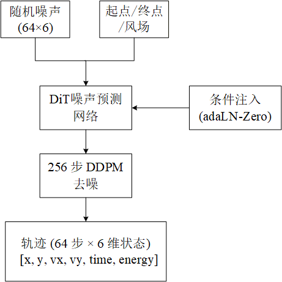

# Diffusion-AS1：基于扩散模型的飞艇轨迹规划

基于去噪扩散概率模型（DDPM）的自主飞艇轨迹规划系统。模型以起点、终点及动态风场为条件，通过迭代去噪生成从噪声中"浮现"的飞艇飞行轨迹。

## 架构概览



## 项目结构

```
Diffusion-AS1/
├── config.py               # 全部超参数
├── train.py                # 训练入口
├── test.py                 # 单条轨迹采样 + 可视化
├── batch_test.py           # 批量测试 30 条，统计成功率/误差
├── sweep_gs.py             # CFG guidance_scale 网格搜索
├── models/
│   ├── diffusion.py        # DDPM/DDIM 采样器 + CFG + 多轨迹 pick-best
│   ├── dit.py              # DiT（Diffusion Transformer）主干
│   ├── unet.py             # 1D U-Net 备选主干
│   └── wind_encoder.py     # CNN 风场编码器（空间版 + 时序注意力版）
├── dynamics/
│   ├── airship.py          # 飞艇动力学（太阳能、能量约束、阻力）
│   ├── wind_field.py       # 风场生成器（基础风 + 阵风团）
│   ├── memory.py           # 循环缓冲区
│   ├── ppo_policy.py       # PPO 策略（生成训练数据用）
│   └── PosTransformer.py   # 经纬度 ↔ 像素坐标
└── data/
    └── dataset.py          # 用 PPO + 飞艇模拟生成训练轨迹
```

## 快速开始

### 环境要求

- Python 3.10+
- PyTorch >= 2.0
- 依赖安装：

```bash
pip install -r requirements.txt
```

### 生成训练数据 + 训练

```bash
# 训练（首次运行自动生成轨迹数据）
python train.py

# TensorBoard 监控
tensorboard --logdir logs/
```

### 轨迹采样

```bash
# 单条采样 + 可视化
python test.py

# 批量测试 + 统计
python batch_test.py

# 搜索最优 guidance_scale
python sweep_gs.py
```

## 核心配置

| 参数 | 值 | 说明 |
|---|---|---|
| 地图尺寸 | 525×300 km（210×120 pixels） | 环境范围 |
| 轨迹长度 | 64 步，每步 7.5 min | 总时长 8 小时 |
| 最大速度 | 15 m/s | 飞艇速度限制 |
| 到达判定 | 距目标 15 km 以内 | 成功条件 |
| 风场基础速度 | 6–10 m/s | 随机方向和强度 |
| 扩散步数 | 256（cosine schedule） | 去噪步数 |
| 训练数据量 | 5000 条轨迹 | PPO + 模拟器生成 |
| CFG 引导强度 | 2.0 | classifier-free guidance |

## 模型架构

### 主干网络：DiT（Diffusion Transformer）

- **6 层** adaLN-Zero Transformer block
- 隐空间维度：**256**
- 注意力头数：**8**
- 条件注入：时间嵌入 + 起点/终点嵌入 + 风场嵌入 → adaLN 调制
- 目标位置以 token 广播方式注入所有轨迹 token

### 风场编码器：WindEncoder / TemporalWindEncoder

```
风场 (2, 12, 21) → Conv2d(2→16→32→64) → FC → 64维向量
                                    └─ MultiheadAttention ─┘ (TemporalWindEncoder)
```

- **WindEncoder**：4 帧风场共享 CNN，展平后拼接
- **TemporalWindEncoder**：8 帧风场 + 时序多头注意力，均值池化后输出

### 去噪采样策略

| 方法 | 说明 |
|---|---|
| `sample()` | 标准 256 步 DDPM 采样 |
| `sample_with_guidance()` | CFG 引导采样（默认 scale=2.0） |
| `sample_ddim()` | DDIM 加速采样（可指定步数） |
| `sample_with_multi_guidance()` | CFG + classifier guidance（进度/边界/能量约束） |
| `sample_multi_pick_best()` | 生成 20 条轨迹，选终点最近目标者 |

## 评估指标

`batch_test.py` 在 30 个随机场景上评估模型：

- **成功率**：终点误差 ≤ 15km 的比例
- **平均误差** / **中位数误差**：终点到目标的距离
- 每条轨迹保存为 PNG（`checkpoints*/batch_results/`）

## 飞艇动力学

飞艇模拟器 (`dynamics/airship.py`) 包含：

- 质量-惯性模型（质量 7001 kg，转动惯量）
- 附加质量效应（m₁₁=0.11, m₂₂=0.83）
- 阻力系数 0.045，偏航阻尼
- 太阳能充电模型（6:00–18:00，峰值 18 kW，二次多项式拟合）
- 能耗约束（最大功率 16 kW，电池 80 kWh）
- 动作平滑（每步速度变化限幅 ±3 m/s²）

## 风场模型

```
基础风（6-10 m/s 随机方向） + 8 个阵风团（±8 m/s，随机位置/大小/方向）
                                     ↓
                    210×120 网格 → 压缩 10× → 21×12
                                     ↓
                           时间插值 3 次（×8 分辨率）
```

## 许可

仅供研究使用。
